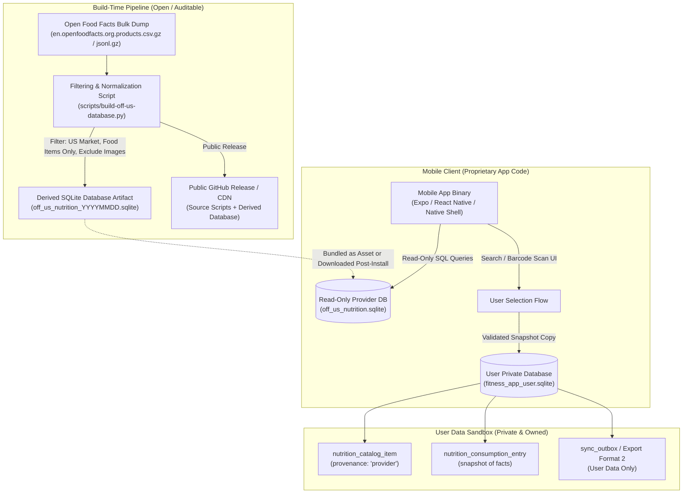

# Open Food Facts Licensing Review Packet: Technical Architecture, Proposed Data Flows, and Legal Analysis

**Document Status:** Counsel-Ready Technical Review Packet  
**Evaluation Target:** Open Food Facts (ODbL 1.0 / DbCL 1.0 / CC BY-SA)  
**Target Market:** United States (US)  
**Date of Technical Preparation:** 2026-08-28  
**Governing Precedents:** [ADR 0035](decisions/0035-nutrition-provenance-and-unapproved-food-data-sourcing.md), [ADR 0037](decisions/0037-initial-nutrition-market-and-independent-sampling-frame.md), [ADR 0038](decisions/0038-fooddata-central-coverage-evaluation-fails.md)

---

## 1. Executive Summary & Purpose

This review packet provides an exhaustive, counsel-ready technical and licensing specification for evaluating the legal feasibility, obligations, and constraints of integrating data from **Open Food Facts** into an offline-first mobile fitness application.

### Background and Prior Sourcing Decisions

1. **Macro Targets Shipped**: Sprint 49 implemented goal-derived daily macronutrient targets ([Specification 0047](../specs/0047-goal-derived-macro-targets.md)), satisfying the first half of Phase 5 (Nutrition Depth).
2. **FoodData Central Coverage Failure**: Sprint 52 executed the independent coverage evaluation of USDA FoodData Central ([ADR 0038](decisions/0038-fooddata-central-coverage-evaluation-fails.md), [coverage evaluation](fooddata-central-coverage-evaluation.md)). Branded-name discovery (31.43%) and exact-barcode discovery (55.58%) failed the required 80% adoption threshold. FoodData Central is **not approved**.
3. **Open Food Facts as Sole Named Path**: Following ADR 0035 and ADR 0038, qualified legal review of Open Food Facts's **Open Database License (ODbL) 1.0** and **Database Contents License (DbCL) 1.0** licensing boundaries is the sole active path to unblock Phase 5's food-database capability.

### Purpose of this Packet

This document does not represent legal advice and does not approve a provider. Its purpose is to:

- Formulate the exact proposed technical architecture, compilation pipeline, storage boundaries, and data flows.
- Structure the analysis of **15 concrete legal and distribution questions** under ODbL 1.0, DbCL 1.0, and Open Food Facts terms.
- Provide qualified legal counsel with an authoritative, unambiguous technical framework from which to render a binding legal opinion.

---

## 2. Product Context, Core Principles & Launch Market

### Core Principles

- **Offline First**: Food search, barcode lookup, and logging must function reliably without active network connectivity.
- **User Ownership & Local Authority**: Personal diaries and custom food profiles created or edited by the user are private, authoritative, and permanent.
- **No Silent Overwrite**: External provider data must never silently overwrite user-entered facts or custom entries.
- **Explicit Provenance**: Provider-sourced nutrition facts must be visibly and programmatically distinct from user-provided facts (`NutritionProvenance`).
- **Privacy by Default**: No user search queries, barcode scans, diet logs, or telemetry are transmitted to third-party servers.
- **US Market Scope**: The initial launch market is the United States ([ADR 0037](decisions/0037-initial-nutrition-market-and-independent-sampling-frame.md)), matching the FDA Nutrition Facts nutrient vocabulary (Energy, Protein, Carbohydrate, Total Fat, Dietary Fiber, Total Sugars, Sodium) and UPC-A / EAN-13 barcode formats.

---

## 3. Proposed Technical Architecture & Data Flows



### 3.1 Data Acquisition Pipeline

- **Source**: Official Open Food Facts bulk data export (`openfoodfacts-products.jsonl.gz` or `.csv.gz`), accessed via official Open Food Facts mirrors.
- **Frequency**: Batch extraction at build/release time, reproducible by deterministic scripts committed to the repository.
- **No Live API Scraping**: The production build avoids dynamic mass scraping of Open Food Facts APIs, respecting community infrastructure guidelines.

### 3.2 Build-Time Transformation & Subset Filtering

The derivation script applies the following strict filtering criteria:

1. **Geographic Filtering**: Records where `countries_tags` contains `en:united-states` or `countries_en` includes `United States` or `US`.
2. **Field Extraction & Normalization**:
   - `code` -> Canonical GTIN (GTIN-8, GTIN-12/UPC-A, GTIN-13/EAN-13, GTIN-14).
   - `product_name` / `product_name_en` -> Trimmed, non-empty display name.
   - `brands` / `brand_owner` -> Normalized brand identifier.
   - `serving_size` / `serving_quantity` -> Resolved canonical reference mass (grams) or volume (milliliters).
   - `energy-kcal_100g` or `energy_100g` -> Canonical `Energy` (calories / kilocalories).
   - Nutrients per 100g/100ml: `proteins`, `carbohydrates`, `fat`, `fiber`, `sugars` (grams), `sodium` (milligrams).
3. **Data Quality & Validation**:
   - Deduplication on canonical GTIN (favoring most recent complete revision).
   - Rejection of non-food products (e.g. pet food, cosmetics) and records lacking required Energy or valid reference dimensions.
4. **Complete Image Exclusion**:
   - Zero image URLs, image binary data, or thumbnail references are extracted or stored.

### 3.3 Storage Separation & Isolation Boundaries

- **Physical Separation**: The resulting filtered database is written to a standalone, read-only SQLite file (`off_us_nutrition_YYYYMMDD.sqlite`).
- **Logical Separation**: The application's native/JavaScript code connects to this database in read-only mode via a dedicated persistence adapter (`OpenFoodFactsSqliteAdapter`).
- **User Sandbox Isolation**: The user's personal database (`fitness_app_user.sqlite`) remains entirely separate.
  - User tables (`personal_profile`, `goal_configuration`, `hydration_entry`, `nutrition_catalog_item`, `nutrition_consumption_entry`, `workout_session`, etc.) reside in the user database.
  - No foreign keys or database triggers link the user database to the provider database.
  - The schema synchronization outbox (`sync_outbox`) and device identity tables never track provider database rows.

### 3.4 User Logging & Snapshotting Flow

1. **Search / Scan**: The user enters a search term or scans a barcode. The app queries `off_us_nutrition.sqlite`.
2. **Selection**: The user reviews search results and selects a food item.
3. **Instantiation & Snapshot Copy**: The application domain creates an immutable, validated `NutritionFacts` instance, with `provenance` marked as `'provider'` (distinguishing it from user-authored `'provided'` or AI `'estimated'`).
4. **Local Write**: The item is copied into the user's private database:
   - If added to reusable catalog: inserted into `nutrition_catalog_item`.
   - If logged to diary: inserted as an independent snapshot in `nutrition_consumption_entry`.
5. **No Upstream Dependency**: Once written, the diary or catalog entry is fully self-contained. Deleting, updating, or replacing the provider database file leaves all historical user logs completely intact.

---

## 4. Comprehensive Analysis of the 15 Legal & Distribution Questions

```
+-----------------------------------------------------------------------------------------+
| Category Key:                                                                           |
| [LEGAL CLAUSE]       - Explicit provision of ODbL 1.0, DbCL 1.0, or Terms of Use         |
| [ENGINEERING FACT]   - Technical reality of the fitness-app architecture and data model   |
| [LEGAL QUESTION]     - Specific question requiring qualified legal counsel conclusion   |
| [PRODUCT POLICY]     - Invariant product principle established in PRODUCT.md / AGENTS.md |
+-----------------------------------------------------------------------------------------+
```

### Question 1: Bundling a dated, filtered US subset inside the mobile application

- **[ENGINEERING FACT]**: The compiled SQLite database (`off_us_nutrition.sqlite`, ~50–100MB) would be placed into the mobile application asset bundle distributed through the Apple App Store (iOS `.ipa`) and Google Play Store (Android `.apk` / `.aab`).
- **[LEGAL CLAUSE]**: Under ODbL 1.0 §1.0, "Publicly Convey" means to distribute or make available copies of the Database to the public. Distributing an application containing the database file constitutes Publicly Conveying the database.
- **[LEGAL QUESTION FOR COUNSEL]**: Does bundling a pre-compiled SQLite database file within an application package distributed via mobile app stores constitute Public Conveyance of a Derivative Database under ODbL 1.0 §4.4?

### Question 2: Distributing the subset as a separate SQLite database alongside proprietary application code

- **[ENGINEERING FACT]**: The SQLite database file is physically distinct from compiled application binaries (`index.bundle`, native machine code). The application code interacts with the database solely via standard SQL queries (e.g., `SELECT code, product_name, energy_kcal FROM products WHERE code = ?`).
- **[LEGAL CLAUSE]**: ODbL 1.0 §4.5 ("Collective Databases") provides: _"You may combine the Database with other separate and independent databases as part of a Collective Database. In such case, this License will continue to apply to the Database but does not apply to the other independent database(s) or materials."_ Furthermore, ODbL 1.0 explicitly defines itself as a database license, not a software license.
- **[LEGAL QUESTION FOR COUNSEL]**: Under ODbL 1.0 §4.4 and §4.5, is the combination of the standalone SQLite database file and the proprietary application code properly classified as a Collective Database / Produced Work, ensuring that the share-alike obligation does not extend to the proprietary mobile application source code?

### Question 3: Post-installation downloading of the database snapshot for offline use

- **[ENGINEERING FACT]**: As an alternative to bundling inside the application store package, the application could download the dated SQLite snapshot over HTTPS upon first launch or upon user request, storing it in the local application sandbox.
- **[LEGAL CLAUSE]**: ODbL 1.0 §4.4.b allows conveying a Derivative Database via a public network using a standard machine-readable format.
- **[LEGAL QUESTION FOR COUNSEL]**: Does downloading the database snapshot post-installation provide cleaner isolation between the application binary and the database conveyance under ODbL §4.4, and does it alleviate potential App Store license/DRM conflicts?

### Question 4: Querying Open Food Facts live and caching individual returned records locally

- **[ENGINEERING FACT]**: The application could execute real-time HTTPS queries to the Open Food Facts API when a user scans a barcode, caching retrieved items in a local SQLite cache table.
- **[LEGAL CLAUSE]**: Individual food records are governed by the Database Contents License (DbCL) 1.0. Under ODbL §4.2 and DbCL 1.0 §2.0, extraction or utilization of insubstantial portions of database contents does not trigger Share-Alike. However, systematic local caching could accumulate a substantial portion over time.
- **[PRODUCT POLICY]**: Live-only lookup violates the **offline-first** product principle (`PRODUCT.md`), rendering barcode and food search useless in gyms or areas without connectivity. Caching also relocates rather than eliminates the database licensing question ([ADR 0035](decisions/0035-nutrition-provenance-and-unapproved-food-data-sourcing.md)).

### Question 5: Persisting person-selected provider records in private local catalog and diary snapshots

- **[ENGINEERING FACT]**: When a user selects a food item from search results, a copy of the canonical nutrient values is inserted into `nutrition_catalog_item` or `nutrition_consumption_entry` in the private, local `fitness_app_user.sqlite` file.
- **[LEGAL CLAUSE]**: ODbL 1.0 §4.4 applies Share-Alike obligations only to a Derivative Database that is _Publicly Conveyed_. Private, personal storage on an individual device is not Public Conveyance.
- **[LEGAL QUESTION FOR COUNSEL]**: Does the act of copying individual selected records into a user's private, device-sandboxed personal database remain exempt from ODbL share-alike obligations under the private use exemption and DbCL 1.0?

### Question 6: Combining Open Food Facts fields with person-provided corrections or additions

- **[ENGINEERING FACT]**: Users have full authority to edit food descriptions, adjust calorie/macro values, or add missing micronutrients to items saved in their catalog.
- **[LEGAL CLAUSE]**: Under US copyright law (_Feist Publications, Inc. v. Rural Telephone Service Co._, 499 U.S. 340 (1991)), raw factual nutritional values (e.g. "80 kcal, 10g protein") are uncopyrightable facts. DbCL 1.0 waives rights in individual contents.
- **[LEGAL QUESTION FOR COUNSEL]**: Does person-driven editing or augmentation of an individual provider record in local storage create any downstream licensing or redistribution obligations under DbCL 1.0 or ODbL 1.0?

### Question 7: Publishing/offering the exact database artifact, transformation scripts, or corresponding source

- **[ENGINEERING FACT]**: The repository can provide open, public access to:
  1. The deterministic Python/Node extraction and transformation scripts (`scripts/build-off-us-database.py`).
  2. The exact compiled SQLite database artifact (`off_us_nutrition_YYYYMMDD.sqlite`) hosted on a public GitHub Release or public CDN.
- **[LEGAL CLAUSE]**: ODbL 1.0 §4.4.a–c specifies how Share-Alike obligations are satisfied when Publicly Conveying a Derivative Database:
  - Making the Derivative Database available on the same medium or by offering a machine-readable form via a public network at no charge for at least 12 months.
  - Making available the relevant scripts, file formats, and instructions used to extract and transform the database.
- **[LEGAL QUESTION FOR COUNSEL]**: Does hosting the filtered SQLite database artifact and the build scripts on a public GitHub release fulfill all source and derivative-database offering requirements of ODbL 1.0 §4.4 without requiring the release of any proprietary application UI or business logic code?

### Question 8: Required attribution, notices, links, modification statements, and license text

- **[LEGAL CLAUSE]**: ODbL 1.0 §4.3 mandates:
  - Keeping intact copyright and license notices.
  - Stating that the database is available under ODbL 1.0 (with a link to `http://opendatacommons.org/licenses/odbl/1.0/`).
  - Providing attribution to Open Food Facts (with a link to `https://world.openfoodfacts.org/`).
  - Stating clearly that modifications were made (e.g., filtered to US market, normalized to FDA nutrition fields).
- **[ENGINEERING FACT]**: The application will include:
  - A permanent, accessible Legal / Third-Party Material screen within the application.
  - A root [`THIRD-PARTY.md`](../THIRD-PARTY.md) file in the source repository.
  - Explicit modification statements accompanying any distributed database file or public release.
- **[LEGAL QUESTION FOR COUNSEL]**: Does the proposed attribution notice format fully satisfy the notice requirements of ODbL 1.0 §4.3 and Open Food Facts terms of use?

### Question 9: Whether database share-alike obligations affect only the database artifact or extend to application code

- **[LEGAL CLAUSE]**: ODbL 1.0 §1.0 defines "Produced Work" as a work resulting from using the Contents of the Database (such as an image, text, search results, or output of a query). ODbL §4.5 states that Produced Works do not inherit the ODbL share-alike obligation, provided attribution is maintained.
- **[LEGAL CLAUSE]**: The Open Data Commons _Community Guidelines on Produced Work vs. Derivative Database_ state that software that merely queries, presents, or processes database records is distinct from the database itself.
- **[LEGAL QUESTION FOR COUNSEL]**: Can counsel confirm that ODbL 1.0 §4.4 copyleft attaches strictly to the database file / data structures and does not infect, contaminate, or force the open-sourcing of the application's proprietary TypeScript, React Native, or native iOS/Android code?

### Question 10: Classification of a filtered, transformed, indexed, or normalized subset

- **[LEGAL CLAUSE]**: ODbL 1.0 §1.0 defines a "Derivative Database" as: _"a database based upon the Database, and includes any translation, adaptation, arrangement, modification, or any other alteration of the Database or of a Substantial part of the Contents."_
- **[ENGINEERING FACT]**: Extracting ~500,000 US records from the global ~3,000,000 record Open Food Facts dataset, reformatting fields, and building SQLite indexes creates a modified, substantial database structure.
- **[LEGAL CONCLUSION]**: The filtered SQLite database artifact is definitively a **Derivative Database** under ODbL 1.0 §1.0 and must be licensed under ODbL 1.0 if Publicly Conveyed.

### Question 11: Ongoing update, access, and source-offer obligations across released application versions

- **[LEGAL CLAUSE]**: ODbL 1.0 §4.4.c requires maintaining public network availability of the Derivative Database for at least 12 months after the last time it was Publicly Conveyed.
- **[ENGINEERING FACT]**: If the mobile application updates its bundled/downloaded database snapshot across version releases (e.g. App v1.1 bundles DB snapshot `2026-09-01`, App v1.2 bundles DB snapshot `2026-10-01`), each released snapshot version must remain available on the public release server for at least 12 months from the release date of that app version.
- **[LEGAL QUESTION FOR COUNSEL]**: Does version-tagging database artifacts on GitHub Releases satisfy the 12-month accessibility obligation across multiple released application versions?

### Question 12: Strict exclusion of Open Food Facts product images

- **[LEGAL CLAUSE]**: Open Food Facts official Terms of Use explicitly declare that product images uploaded by contributors are licensed under **Creative Commons Attribution-ShareAlike (CC BY-SA 2.0 / 3.0 / 4.0)**, which is a separate copyright license from the database's ODbL 1.0.
- **[PRODUCT POLICY]**: Product images are **100% EXCLUDED** from the application:
  - CC BY-SA on visual media introduces complex UI attribution and share-alike constraints.
  - Image assets would inflate the offline bundle by tens of gigabytes, making offline bundling impossible.
  - Excluding images eliminates copyright risks associated with packaging artwork, trademarks, and third-party commercial brand imagery.
- **[LEGAL CONCLUSION]**: The complete exclusion of all product image URLs and image data eliminates all CC BY-SA image licensing obligations from the product.

### Question 13: App store distribution restrictions, DRM, and parallel distribution

- **[LEGAL CLAUSE]**: ODbL 1.0 §4.4.d forbids applying Technological Protection Measures (DRM) to a Derivative Database that restricts a recipient from exercising their rights under ODbL.
- **[LEGAL CLAUSE]**: ODbL 1.0 §4.4.b provides a "Parallel Distribution" safe harbor: _"You may satisfy this Section by making the Derivative Database available... at no charge on a medium customarily used for carrying data, or via a public network... at the same time as you Publicly Convey the Derivative Database."_
- **[LEGAL QUESTION FOR COUNSEL]**: Does publishing the unencrypted Derivative Database via a public URL / GitHub Release satisfy ODbL §4.4.b and cure any potential restriction caused by Apple FairPlay or Google Play DRM applied to the compiled mobile app package?

### Question 14: Material differences between direct bulk-download use and API-derived use

- **[ENGINEERING FACT]**: Build-time bulk processing operates on complete, cryptographically verified database dumps, whereas API queries interact with live web services.
- **[LEGAL CLAUSE]**: Both bulk data and API responses originate from the same ODbL/DbCL database. However, API access is additionally subject to the Open Food Facts API Terms of Service (rate limits, User-Agent identification, server abuse prohibitions).
- **[LEGAL CONCLUSION]**: Build-time bulk generation is technically superior for offline-first reproducibility and avoids ongoing operational dependencies or API terms compliance.

### Question 15: Open Food Facts trademarks, attribution guidance, and non-endorsement

- **[LEGAL CLAUSE]**: The name "Open Food Facts" and its eye/barcode logo are registered trademarks of the Open Food Facts Association.
- **[LEGAL CLAUSE]**: Trademark law and Open Food Facts terms permit descriptive use for mandatory attribution (e.g. _"Data sourced from Open Food Facts"_), but forbid confusing, false, or endorsement-implying uses (e.g. naming the app _"Open Food Facts Tracker"_ or using their logo as the primary app icon).
- **[PRODUCT POLICY]**: The application will use plain text attribution without logos or endorsement claims, complying with trademark fair use.

---

## 5. Primary Legal Sources, Clauses, and Access Dates

Every legal finding and question in this packet is anchored directly to primary source materials:

1. **Open Database License (ODbL) v1.0**:
   - **Source**: Open Data Commons / Open Knowledge Foundation
   - **URL**: [https://opendatacommons.org/licenses/odbl/1.0/](https://opendatacommons.org/licenses/odbl/1.0/)
   - **Access Date**: 2026-08-28
   - **Operative Sections**: §1.0 (Definitions: Derivative Database, Collective Database, Produced Work, Publicly Convey), §4.2 (Extraction and Re-utilisation), §4.3 (Notice and Attribution), §4.4 (Share-Alike / Derivative Databases), §4.5 (Collective Databases), §4.6 (Produced Works).

2. **Database Contents License (DbCL) v1.0**:
   - **Source**: Open Data Commons / Open Knowledge Foundation
   - **URL**: [https://opendatacommons.org/licenses/dbcl/1.0/](https://opendatacommons.org/licenses/dbcl/1.0/)
   - **Access Date**: 2026-08-28
   - **Operative Sections**: Rights in contents, waiver of copyright in individual database entries.

3. **Open Food Facts Terms of Use & Legal Notices**:
   - **Source**: Open Food Facts Association
   - **URL**: [https://world.openfoodfacts.org/terms-of-use](https://world.openfoodfacts.org/terms-of-use)
   - **Access Date**: 2026-08-28
   - **Operative Clauses**: ODbL database licensing, CC BY-SA 2.0/3.0/4.0 image licensing, API usage guidelines, trademark notices.

4. **Creative Commons Attribution-ShareAlike (CC BY-SA 2.0 / 3.0 / 4.0)**:
   - **Source**: Creative Commons
   - **URL**: [https://creativecommons.org/licenses/by-sa/4.0/](https://creativecommons.org/licenses/by-sa/4.0/)
   - **Access Date**: 2026-08-28
   - **Operative Clauses**: Share-alike obligations for adapted visual media (triggering the complete exclusion of images).

5. **Open Data Commons Community Guidelines**:
   - **Source**: Open Data Commons Working Group
   - **URL**: [https://opendatacommons.org/guide/](https://opendatacommons.org/guide/)
   - **Access Date**: 2026-08-28
   - **Operative Guidance**: Guideline on Produced Work vs Derivative Database.

6. **United States Copyright Doctrine**:
   - **Source**: _Feist Publications, Inc. v. Rural Telephone Service Co._, 499 U.S. 340 (1991)
   - **Principle**: Raw factual nutrition information (calories, macronutrient counts, ingredient lists) lacks the minimum creative originality required for copyright protection under Title 17 of the United States Code.

---

## 6. Actionable Counsel Questionnaire & Decision Framework

For qualified legal counsel reviewing this packet, the decision framework is organized into four core questions:

```
+----------------------------------------------------------------------------------------------------+
| COUNSEL QUESTION 1: CODEBASE ISOLATION                                                              |
| Does bundling or downloading a standalone SQLite Derivative Database under ODbL 1.0 infect or      |
| impose any copyleft / open-source obligation on the proprietary mobile application codebase,       |
| given that the software interacts with the database solely via SQL queries as a Produced Work?     |
+----------------------------------------------------------------------------------------------------+
| COUNSEL QUESTION 2: SOURCE OFFER SATISFACTION                                                       |
| Does hosting the exact filtered SQLite database file and build scripts on a public GitHub Release  |
| or public CDN satisfy the Share-Alike offering requirements of ODbL 1.0 §4.4.a–c?                  |
+----------------------------------------------------------------------------------------------------+
| COUNSEL QUESTION 3: APP STORE DISTRIBUTION & DRM                                                    |
| Does providing parallel distribution of the unencrypted Derivative Database via a public URL       |
| satisfy ODbL 1.0 §4.4.b and resolve potential conflicts with Apple/Google App Store terms and DRM?  |
+----------------------------------------------------------------------------------------------------+
| COUNSEL QUESTION 4: PRIVATE LOCAL USER DATA EXEMPTION                                              |
| Does copying individual selected nutrition facts into the user's private, device-sandboxed SQLite   |
| tables remain exempt from public distribution and share-alike obligations?                          |
+----------------------------------------------------------------------------------------------------+
```

### Next Steps

1. The repository owner submits this review packet to qualified legal counsel.
2. Counsel renders a formal opinion answering the four core questions.
3. Upon receipt of counsel's opinion, a future sprint records Outcome A (if acceptable) or Outcome B (if incompatible) in an architecture decision record before any provider architecture or implementation begins.
