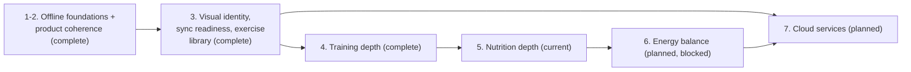

# Product roadmap

## Purpose

This document tracks the repository's path from its completed foundations
toward the product's end goal. It is the authoritative record of phase
status, dependencies, and exit criteria. It does not restate specifications
or architecture decisions — it links to them. `PRODUCT.md` remains the
narrative of product vision, principles, and what shipped and why;
`README.md` states the current repository status in one paragraph and links
here for detail.

Provisional entries in this document are direction, not a promise of scope,
sequence, or schedule. Sprint numbers are assigned only when a sprint is
approved. Dates are never invented.

## End goal

A production-quality, offline-first fitness application that lets a person
plan, record, understand, protect, and move their nutrition, hydration,
training, and body-measurement information without requiring connectivity —
while progressively adding training guidance, nutrition depth, energy
balance, and optional reconciled cloud services without weakening local
ownership, accessibility, privacy, deterministic behavior, or recovery. It
is not a medical device and does not diagnose, treat, or replace
professional advice.

This statement is a refinement of the vision in [PRODUCT.md](../PRODUCT.md),
made concrete enough to track exit criteria against. "Done" means every
domain named above is deep enough to be someone's only fitness tool offline,
with cloud reconciliation available but never required. It does not mean
every feature a fitness application could have is built.

## Status vocabulary

- **Complete** — shipped, merged, and described by an accepted specification
  or durable architecture document.
- **Current** — the phase presently being worked.
- **Planned** — direction stated in `PRODUCT.md`, not yet started, not yet
  specified.
- **Candidate** — an unnumbered, unapproved capability under a planned or
  current phase. Naming a candidate here is not approval to build it.
- **Blocked** — planned work whose prerequisite has not been met.
- **Optional** — a phase whose existence is not yet justified by repository
  evidence; recorded so it isn't silently forgotten, not because it is
  scheduled.

## Phase table

| Phase                                | Status           | Outcome                                                                                                                                                                    | Prerequisites                                                                | Supporting documents                                                                                                                                                                                                                                                                                                                                                                                                                                                                                                                                                                                                                                                                                            |
| ------------------------------------ | ---------------- | -------------------------------------------------------------------------------------------------------------------------------------------------------------------------- | ---------------------------------------------------------------------------- | --------------------------------------------------------------------------------------------------------------------------------------------------------------------------------------------------------------------------------------------------------------------------------------------------------------------------------------------------------------------------------------------------------------------------------------------------------------------------------------------------------------------------------------------------------------------------------------------------------------------------------------------------------------------------------------------------------------- |
| 1. Offline foundations               | Complete         | Every domain (profile, goals/energy, nutrition, hydration, workouts, body measurement) reads and writes fully offline, with export, restore, erasure, and safe replacement | —                                                                            | Specs 0001–0026, ADRs 0001–0021                                                                                                                                                                                                                                                                                                                                                                                                                                                                                                                                                                                                                                                                                 |
| 2. Product coherence                 | Complete         | Every screen states exactly what it computed; workouts are correctable, deletable, addable, and renameable by their owner; history periods govern their own lists          | Phase 1                                                                      | Specs 0031, 0032, 0035–0040, ADRs 0022, 0025–0030                                                                                                                                                                                                                                                                                                                                                                                                                                                                                                                                                                                                                                                               |
| 3a. One visual identity              | Complete         | One deliberate, contrast-proven visual identity; no screen loses a stated value                                                                                            | Phase 2                                                                      | [Specification 0041](../specs/0041-the-app-has-one-visual-identity.md)                                                                                                                                                                                                                                                                                                                                                                                                                                                                                                                                                                                                                                          |
| 3b. Schema synchronization readiness | Complete         | Every owned table carries update time, tombstone, revision, and originating device; a local outbox records unsent changes; nothing leaves the device                       | Phase 3a (paying the migration cost once, before further tables exist)       | [Specification 0042](../specs/0042-schema-synchronization-readiness.md), [ADR 0032](decisions/0032-schema-synchronization-readiness.md)                                                                                                                                                                                                                                                                                                                                                                                                                                                                                                                                                                         |
| 3c. A usable exercise library        | Complete         | Library ships empty and offers 215 curated definitions across a starter and an expanded pack; deletions of imported definitions are recoverable without discarding edits   | Phase 3b (tombstone model had to exist first)                                | [Specification 0027](../specs/0027-starter-exercise-library.md), [0043](../specs/0043-expanded-exercise-library.md), [0044](../specs/0044-deliberate-exercise-pack-restoration.md)                                                                                                                                                                                                                                                                                                                                                                                                                                                                                                                              |
| 4. Training depth                    | Complete         | Separates a log of what happened from a tool that informs what to do next                                                                                                  | Phases 1–3                                                                   | [Specification 0045](../specs/0045-foreground-rest-timing.md) (rest timing), [Specification 0046](../specs/0046-record-reps-in-reserve.md) (reps in reserve) — see "Training depth direction" below for remaining unapproved candidates                                                                                                                                                                                                                                                                                                                                                                                                                                                                         |
| 5. Nutrition depth                   | Current          | Two independent tracks: (a) macro targets derived from existing goal/energy calculations; (b) a real food database behind the existing catalog with barcode entry          | Phase 4 (stated sequencing in `PRODUCT.md`, not a hard technical dependency) | Track (a): [Specification 0047](../specs/0047-goal-derived-macro-targets.md), implemented in Sprint 49. Track (b): initial market (US) and independent sampling frames approved in Sprint 51 ([ADR 0037](decisions/0037-initial-nutrition-market-and-independent-sampling-frame.md), [sampling frame evaluation](nutrition-sampling-frame-evaluation.md)); Sprint 52 executed the coverage evaluation and FoodData Central **fails** it ([ADR 0038](decisions/0038-fooddata-central-coverage-evaluation-fails.md), [coverage evaluation](fooddata-central-coverage-evaluation.md)); food database remains unapproved — qualified Open Food Facts legal review (ADR 0035) is the remaining named unblocking path |
| 6. Energy balance                    | Planned, blocked | Intake measured against expenditure, derived on-device                                                                                                                     | Phases 4 and 5 both reaching sufficient depth                                | Neither pillar alone can express this; explicit dependency stated in `PRODUCT.md`                                                                                                                                                                                                                                                                                                                                                                                                                                                                                                                                                                                                                               |
| 7. Cloud services                    | Planned          | Authentication, authoritative server behavior, reconciliation of the local outbox                                                                                          | Phase 3b                                                                     | No specification yet                                                                                                                                                                                                                                                                                                                                                                                                                                                                                                                                                                                                                                                                                            |
| 8. Portfolio / release readiness     | Optional         | Not yet justified by repository evidence                                                                                                                                   | —                                                                            | Recorded here so it is considered, not scheduled                                                                                                                                                                                                                                                                                                                                                                                                                                                                                                                                                                                                                                                                |

## Dependency diagram

The table above is authoritative. This diagram visualizes the same
dependencies for a reader who finds a graph faster to scan; it introduces no
relationship the table does not already state, and it carries no dates.

## Phase exit criteria

Stated as outcomes, not task lists. A phase exits when:

- **1. Offline foundations** — a person can plan, record, and understand
  nutrition, hydration, training, and body measurement with no network
  connection, and can export, restore into an empty installation, replace,
  or erase everything the device stores. _(Met.)_
- **2. Product coherence** — no screen presents a computed value inconsistent
  with what it actually counted, and a person can correct, add to, remove
  from, delete, or rename their own completed history without erasing
  unrelated data. _(Met.)_
- **3. Visual identity, sync readiness, usable library** — the application
  has one contrast-proven visual identity; every owned table carries the
  metadata a future synchronization design needs, with nothing transmitted;
  and a new installation can reach a broad, editable exercise library in a
  few deliberate actions, including recovering a deleted definition without
  losing edits. _(Met — Specs 0041, 0042, 0043, 0044.)_
- **4. Training depth** — a person can see more than a bare log of sets: at
  minimum, a way to observe how a session's effort or pacing behaved without
  the application asserting a fact it did not record. _(Met. Sprint 46
  shipped rest timing — [Specification 0045](../specs/0045-foreground-rest-timing.md)
  — as Phase 4's first capability, but a forward-looking rest countdown is
  not itself an observation of a session's effort or pacing. Sprint 47
  shipped optional reps-in-reserve recording —
  [Specification 0046](../specs/0046-record-reps-in-reserve.md) — which is:
  a person-reported observation of how a repetition-based set's effort
  behaved, attached to the set it describes. [ADR 0034](decisions/0034-reps-in-reserve-is-a-recorded-observation.md)
  records why this is a recorded fact rather than the kind of derived
  estimate this codebase excludes elsewhere. This satisfies the exit
  criterion.)_
- **5. Nutrition depth** — logging a food item finds it in a real database
  most of the time, and a person has a macro target derived from their own
  goal and energy configuration. _(Not yet met — one half of two. Sprint 49
  implemented [Specification 0047](../specs/0047-goal-derived-macro-targets.md):
  a person with a saved, valid goal now sees protein, carbohydrate, and fat
  targets alongside their calculated daily calorie target, satisfying the
  macro-target half. Sprint 50 found promising internal FoodData Central
  completeness but withheld approval ([ADR 0036](decisions/0036-fooddata-central-coverage-remains-unproven.md)).
  Sprint 51 approved the United States as the initial launch market and approved
  independent sampling frames ([ADR 0037](decisions/0037-initial-nutrition-market-and-independent-sampling-frame.md),
  [Sampling frame evaluation](nutrition-sampling-frame-evaluation.md)). Sprint 52 executed
  that evaluation: FoodData Central's branded-name (31.43%) and exact-barcode (55.58%)
  discovery both fail their required 80% thresholds by a wide margin, so FoodData Central
  is **not approved** ([ADR 0038](decisions/0038-fooddata-central-coverage-evaluation-fails.md),
  [coverage evaluation](fooddata-central-coverage-evaluation.md)). The food-database
  half remains unmet; qualified Open Food Facts legal review (ADR 0035) is the remaining
  named unblocking path. This phase does not exit until both halves are independently met.)_
- **6. Energy balance** — a person can see intake measured against
  expenditure, computed entirely on-device from data they already logged.
  _(Not yet met; blocked on 4 and 5.)_
- **7. Cloud services** — a person's data can reconcile with a server without
  local-first behavior becoming a requirement to use the application.
  _(Not yet met.)_

## Training depth direction (provisional)

The candidates named in `PRODUCT.md` were: rest timing within a session,
effort recorded as reserve or exertion, estimated one-repetition maximum,
grouped sets or supersets, and progression schemes. **Rest timing shipped in
Sprint 46 as [Specification 0045](../specs/0045-foreground-rest-timing.md)**,
and **reps in reserve shipped in Sprint 47 as
[Specification 0046](../specs/0046-record-reps-in-reserve.md)**. That
satisfied Phase 4's exit criterion (see above), so the phase is complete.
Estimated one-repetition maximum, grouped sets or supersets, progression
schemes, and rate of perceived exertion (RPE) remain unapproved candidates
that a later phase or a future sprint may propose on their own review;
recording them here is not a promise any will ship in this form, this order,
or at all.

**Rest timing shipped first**, based on Sprint 45's repository-based
discovery:

- **Dependencies:** none on new schema. A foreground countdown needs no
  persisted column — confirmed by the shipped implementation.
- **Shipped outcome:** a person can start an optional, dismissible rest
  countdown, choosing from four preset durations (60, 90, 120, or 180
  seconds), after logging a set during an active Workout Session, entirely
  in the foreground, with no persisted state and no notification.
- **Relationship to later candidates:** a natural extension is a per-exercise
  default rest duration stored on `ExerciseDefinition` (a nullable column,
  requiring a migration) once the foreground-only version proves the
  interaction is worth persisting. Per-set overrides could follow that.
  Neither is approved scope.
- **Major exclusions (held for this version):** any persisted rest-duration
  state, any notification or alarm, any background timer, any auto-advance
  behavior. These remain excluded until a future sprint explicitly proposes
  and justifies them.

**Reps in reserve shipped second**, based on Sprint 47's repository-based
discovery, which revisited the reasoning below and found it did not survive
scrutiny — see
[ADR 0034](decisions/0034-reps-in-reserve-is-a-recorded-observation.md) for
the full argument:

- **Dependencies:** one additive, nullable, `CHECK`-constrained column on
  `workout_set` (migration 13), and an export-format version increment to 2.
- **Shipped outcome:** a person can optionally record, on any
  repetition-based set, their own estimate (0–10) of how many additional
  repetitions they believed they could have performed. Absence is preserved
  as `null`, never zero, and the estimate travels with the set through
  correction, export, restore, and safe replacement.
- **Why this was previously sequenced after rest timing rather than
  approved outright:** Sprints 12, 13, 32, and 35 each named RIR or RPE and
  excluded it from their own narrower scope, and Sprint 45's discovery read
  that pattern as a stronger, blanket objection — "it adds a subjective,
  contested field to a codebase whose stated principle is correctness before
  novelty and deterministic behavior over guesses" — which appeared to put it
  in the same category [ADR 0017](decisions/0017-deterministic-workout-personal-records.md)
  already rejected (estimated one-repetition maximum, refused because "it is
  not a recorded fact"). Sprint 47 examined that apparent conflict directly:
  an estimated one-repetition maximum is a value the _application_ computes
  from a lighter set; reps in reserve is a value the _person_ reports about
  themselves, which the application transcribes and validates but never
  infers. ADR 0017's "not a recorded fact" describes the first case, not the
  second. RPE is not reopened by this reasoning — its externally anchored
  scale was not evaluated here — and remains excluded.
- **Major exclusions (held for this version):** RPE; fractional, negative, or
  above-range RIR; RIR-based personal records, comparisons, or analytics; a
  default or copied-forward RIR; RIR on a duration, distance, or
  distance-and-duration result, or on `ExerciseDefinition` or a planned
  prescription. These remain excluded until a future sprint explicitly
  proposes and justifies them.

**Why not the remaining candidates first:**

- _Estimated one-repetition maximum_ — already considered and rejected by
  [ADR 0017](decisions/0017-deterministic-workout-personal-records.md),
  which states plainly that an estimate "is not a recorded fact."
  Reopening it would require a new ADR superseding that decision, not an
  extension of it.
- _Grouped sets or supersets_ — the largest blast radius of the remaining
  candidates: it changes the ordering model shared by the Planner, active
  Sessions, completed history, and personal records simultaneously, per
  [offline-workout-sessions.md](architecture/offline-workout-sessions.md).
- _Progression schemes_ — structurally blocked. The Planner is documented
  as one recurring week with no multi-week program
  ([offline-workout-planner.md](architecture/offline-workout-planner.md)),
  and a progression scheme needs history across weeks the Planner does not
  yet model.
- _RPE_ — not reopened by Sprint 47's reasoning above; a future sprint
  proposing it starts from [ADR 0034](decisions/0034-reps-in-reserve-is-a-recorded-observation.md)'s
  stated line rather than from the blanket exclusion this document
  previously recorded.

[Specification 0045](../specs/0045-foreground-rest-timing.md) documents rest
timing in full. No implementation specification exists for the remaining
four candidates; a future sprint may propose one.

## Nutrition depth direction (provisional)

Sprint 48 reviewed the open question this document and `PRODUCT.md` had
already recorded — how food-product data can be obtained without
inheriting a share-alike obligation on a derived database, while keeping
offline-first logging intact — against current primary sources, rather
than assuming it remained accurate or guessing a resolution. It found the
question still open, and found that Phase 5's two-part exit criterion does
not need to be resolved as one decision.

- **Macro targets shipped first, as their own track.** [Specification
  0047](../specs/0047-goal-derived-macro-targets.md), approved in Sprint 48
  and implemented in Sprint 49, derives a daily protein, carbohydrate, and
  fat target from a person's existing calorie target using a fixed
  distribution inside the published Acceptable Macronutrient Distribution
  Range. It needed no food data, no provider, and no schema change — Goals &
  Energy has no code-level dependency on the nutrition catalog, confirmed
  during Sprint 48's review and unchanged by implementation.
- **Food-database sourcing remains unapproved, as a separate track.** [ADR
  0035](decisions/0035-nutrition-provenance-and-unapproved-food-data-sourcing.md)
  records the full comparison. In brief: USDA FoodData Central is public
  domain with no redistribution restriction, but this sprint could not
  verify its Branded Foods barcode coverage is adequate on its own. Open
  Food Facts has the barcode coverage but licenses its data under ODbL 1.0
  and DbCL 1.0, and its own published terms do not resolve whether bundling
  a filtered subset inside a distributed application triggers the
  share-alike obligation on that subset. Neither gap is a formality; each
  needs a specific unblocking step named in ADR 0035 (qualified legal
  review, or a coverage-adequacy evaluation) before a provider can be
  approved.
- **Nutrition provenance is not yet ready for a provider either way.**
  `NutritionProvenance` is a closed `'provided' | 'estimated'` union today.
  ADR 0035 records that a provider-sourced value needs its own provenance
  value and a write path that never overwrites a person's own entry —
  a domain change to design and review when a provider is eventually
  approved, not before.

Sprint 50 executed ADR 0035's coverage-evaluation path without lowering the
acceptance bar after seeing the data. The [April 2026 aggregate
profile](fooddata-central-coverage-evaluation.md) found 430,240 distinct live,
valid Branded GTINs; 97.05% of selected records had energy plus all three
macros, and 80.95% had all seven application fields. FNDDS also populated all
seven fields for 5,431 of 5,432 foods. Those are strong internal completeness
results, but not hit rates: no independent representative sample or named launch
market existed, and 99.75% of selected Branded records were U.S.-labelled. [ADR
0036](decisions/0036-fooddata-central-coverage-remains-unproven.md) therefore
chose evidence-insufficient Outcome C.

Sprint 51 defined the **United States (US)** as the initial nutrition launch market
and approved the independent sampling frames in [ADR
0037](decisions/0037-initial-nutrition-market-and-independent-sampling-frame.md) and
the [sampling frame evaluation](nutrition-sampling-frame-evaluation.md): CDC/USDA
NHANES WWEIA dietary recall frequency data for ordinary foods, and an Open Food
Facts US dated snapshot as an unweighted retail assortment frame for branded product
names and exact barcodes. With market and sampling prerequisites met, the evaluation
can now be executed against FoodData Central under pre-fixed Sprint 50 thresholds.
FoodData Central remains unapproved pending those results; qualified Open Food Facts
legal review remains the alternative unblocker.

Sprint 52 executed that evaluation against 385 independently sampled items per
stratum (NHANES/WWEIA for ordinary foods, the Open Food Facts US snapshot for
branded names and barcodes) under the unchanged Sprint 50 thresholds. Ordinary-food
discovery passed comfortably (98.96%, though the result carries a disclosed
data-lineage caveat — FoodData Central republishes the same USDA FNDDS vocabulary
NHANES uses to code recalls). Branded-name discovery (31.43%) and exact-barcode
discovery (55.58%, a clean canonical-GTIN equality measurement) both failed their
required 80% thresholds by a wide margin, and branded-name ambiguity (14.03%)
exceeded its 5% ceiling. Because the three discovery thresholds are conjunctive,
**FoodData Central is not approved** ([ADR
0038](decisions/0038-fooddata-central-coverage-evaluation-fails.md), [coverage
evaluation](fooddata-central-coverage-evaluation.md)). Qualified Open Food Facts
legal review (ADR 0035) is now the sole remaining named path to unblock Phase 5's
food-database half; no second coverage evaluation of FoodData Central is pending.

**Why not decide the provider question now.** Guessing an answer to an
unresolved license or coverage question, or silently narrowing Phase 5 to
"whichever source is easiest to bundle," would produce exactly the kind of
invented certainty this program's evidence-over-assumptions principle
exists to prevent (`PRODUCT.md`). Recording both open conditions precisely
means a future sprint can act the moment either is met, instead of
re-deriving this comparison from scratch.

## Release readiness observations (provisional)

A Workout Session UI/UX review found that adding and removing exercises
and sets during an active session can become visually confusing as a
session grows. That redesign is deliberately deferred: it is a Phase 8
(Portfolio / release readiness) concern, not a Phase 4 or Phase 5 one, and
no Workout Session screen, control, or route changed in Sprint 48 or is
approved to change under Nutrition Depth. Recording it here keeps the
observation from being lost without promising it any sequence, sprint, or
scope ahead of Phase 8's own review.

## Adaptability rules

- A candidate capability stays unnumbered and unassigned to a sprint until
  approved. Approval assigns a sprint number in the same change that updates
  this document.
- A phase may be split when its scope turns out to need independently
  reviewable specifications — Phase 3 already happened this way, becoming
  3a/3b/3c across Specifications 0041, 0042, and 0043/0044.
- A phase may be combined, reordered, paused, or removed when repository
  evidence changes the dependency picture. Record why in the change log
  below; do not leave a contradicting note elsewhere.
- Inserting a newly discovered prerequisite is a table edit plus a change-log
  line, not a rewrite of surrounding phases.
- Historical specifications are never edited to match a later roadmap
  change; only their status notes are corrected if a later specification
  supersedes part of them, exactly as Specification 0043's regression note
  now points at Specification 0044.

## Maintenance

`AGENTS.md` states the standing rule that ties sprint work to this document.
The rule is intentionally one sentence there; the mechanics of applying it
are the adaptability rules above.

## Material change log

Only changes to status, sequencing, dependencies, exit criteria, or the end
goal are recorded here — not every edit to this file.

- **2026-08-25 — Sprint 45.** Roadmap created. Phases 1 through 3 (3a/3b/3c)
  recorded as complete based on merged specifications through 0044. Phase 4
  (Training depth) recorded as current, with rest timing recommended as the
  provisional first candidate after repository-based discovery. No
  capability implemented; no specification created for Phase 4.
- **2026-08-25 — Sprint 46.** Rest timing shipped as
  [Specification 0045](../specs/0045-foreground-rest-timing.md): an optional,
  explicit-start, foreground-only rest countdown after a set saves
  successfully, with no persisted state, notification, or background timer.
  Phase 4 remains Current, not Complete — its stated exit criterion is an
  observation of a session's effort or pacing, which a forward-looking rest
  countdown does not provide. The remaining four Training Depth candidates
  (effort as RIR/RPE, estimated one-repetition maximum, grouped sets or
  supersets, progression schemes) remain provisional and unapproved.
- **2026-08-26 — Sprint 47.** Optional reps-in-reserve (RIR) recording
  shipped as [Specification 0046](../specs/0046-record-reps-in-reserve.md):
  a person can optionally record, on any repetition-based set, their own
  0–10 estimate of how many additional repetitions they believed they could
  have performed, persisted through correction, export (format version 2),
  restore, and safe replacement. [ADR 0034](decisions/0034-reps-in-reserve-is-a-recorded-observation.md)
  records why this is a recorded self-report rather than the kind of derived
  estimate [ADR 0017](decisions/0017-deterministic-workout-personal-records.md)
  already excludes, correcting Sprint 45's discovery note that had read RIR
  as categorically excluded. Phase 4's exit criterion — an observation of a
  session's effort or pacing — is met by this capability, so **Phase 4 is now
  Complete**. Estimated one-repetition maximum, grouped sets or supersets,
  progression schemes, and RPE remain unapproved candidates for a later
  phase.
- **2026-08-26 — Sprint 48.** Discovery, architecture, and licensing sprint
  for Phase 5 (Nutrition Depth); no capability implemented. Verified the
  previously recorded food-data sourcing blocker against current primary
  sources and confirmed it is still open, then split Phase 5's two-part
  exit criterion into independently sequenced tracks. Approved
  [Specification 0047](../specs/0047-goal-derived-macro-targets.md) —
  goal-derived daily macro targets, needing no food data — for
  implementation in Sprint 49. Declined to approve any food-data provider:
  [ADR
  0035](decisions/0035-nutrition-provenance-and-unapproved-food-data-sourcing.md)
  records that USDA FoodData Central's barcode coverage is unverified and
  Open Food Facts's ODbL/DbCL terms do not resolve whether bundling a
  filtered subset inside a distributed application triggers its
  share-alike obligation, and names the two conditions — qualified legal
  review, or a coverage-adequacy evaluation — that would each
  independently unblock a future sourcing decision. Phase 5 moves from
  Planned to **Current**, not Complete. Also recorded, for Phase 8, a
  Workout Session UI/UX observation (exercise and set controls can become
  visually confusing as a session grows) that this sprint deliberately did
  not act on.
- **2026-08-26 — Sprint 49.** Implemented [Specification
  0047](../specs/0047-goal-derived-macro-targets.md): a person with a saved,
  currently valid goal now sees a protein, carbohydrate, and fat target,
  each in whole grams, alongside their existing calculated daily calorie
  target on the Goals & Energy screen, derived entirely on-device from
  values already computed there. No food data, provider, schema, migration,
  export change, or network call was introduced. Implementation found the
  "calculated-target card" the specification described actually lives in
  `GoalConfigurationForm.tsx` as a live preview of the form's current
  selection, not as a field on `EnergySummary` rendered by
  `GoalsEnergyScreen.tsx` as originally drafted; Specification 0047 was
  amended in place to record this and to point at the actual test
  locations. Phase 5's macro-target half of its exit criterion is now met;
  the food-database half remains unapproved per ADR 0035. Phase 5 stays
  **Current**, not Complete, and Phase 6 stays blocked.
- **2026-08-26 — Sprint 50.** Fixed measurable discovery, completeness, and
  ambiguity thresholds before profiling FoodData Central's April 2026 bulk
  release. Internal structure was promising: 430,240 distinct live, valid
  Branded GTINs, 97.05% with energy and all three macros, and 80.95% with all
  seven application fields; FNDDS populated all seven for 5,431 of 5,432
  foods. Adoption remains unapproved because ordinary-food, branded-name, and
  barcode discovery could not be tested against an independent representative
  sample, the launch market is unnamed, and the measured Branded records are
  99.75% U.S.-labelled. [ADR
  0036](decisions/0036-fooddata-central-coverage-remains-unproven.md) records
  evidence-insufficient Outcome C. No provider integration or implementation
  specification was created. Phase 5 remains **Current** and Phase 6 remains
  blocked.
- **2026-08-27 — Sprint 51.** Defined the **United States (US)** as the initial
  nutrition launch market and approved independent sampling frames in [ADR
  0037](decisions/0037-initial-nutrition-market-and-independent-sampling-frame.md) and
  the [sampling frame evaluation](nutrition-sampling-frame-evaluation.md). The
  ordinary-food stratum uses CDC/USDA NHANES WWEIA dietary recall frequency data;
  the branded-name and exact-barcode strata use an Open Food Facts US dated snapshot
  as an unweighted retail assortment frame under ODbL analytical evaluation use.
  Accepted Sprint 50 thresholds remain fixed. No food provider is approved; Phase 5
  remains **Current** and Phase 6 remains blocked.
- **2026-08-28 — Sprint 52.** Executed the independent FoodData Central coverage
  evaluation approved in Sprint 51, sampling 385 items per stratum (seed `20260827`)
  from the NHANES WWEIA and Open Food Facts US frames and measuring them against the
  April 2026 FoodData Central bulk release under the unchanged Sprint 50 thresholds.
  Ordinary-food discovery passed (98.96%, CI lower 97.36%, disclosed FNDDS-lineage
  caveat). Branded-name discovery (31.43%, CI lower 26.99%) and exact-barcode discovery
  (55.58%, CI lower 50.59%) both failed their required 80%/CI-lower->75% thresholds, and
  branded-name ambiguity (14.03%) exceeded its 5% ceiling. A defect found in the
  branded-name matcher's scoring formula (via independent GTIN cross-validation) was
  corrected and disclosed with before/after numbers; the correction did not change the
  stratum's fail conclusion or the exact-barcode/ordinary-food results. **FoodData
  Central is not approved** ([ADR
  0038](decisions/0038-fooddata-central-coverage-evaluation-fails.md), [coverage
  evaluation](fooddata-central-coverage-evaluation.md)). Qualified Open Food Facts legal
  review (ADR 0035) is the remaining named unblocking path. No provider integration,
  barcode scanner, schema, or runtime dependency was added. Phase 5 remains **Current**
  and Phase 6 remains blocked.

## Authoritative references

- [PRODUCT.md](../PRODUCT.md) — vision, principles, and phase narrative.
- [specs/](../specs/README.md) — approved specifications.
- [docs/decisions/](decisions) — accepted architecture decision records.
- [docs/architecture/](architecture) — current implemented structure.
- [docs/manual-testing/README.md](manual-testing/README.md) — physical-device
  verification policy (ADR 0033).
