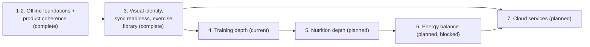

# Product roadmap

## Purpose

This document tracks the repository's path from its completed foundations
toward the product's end goal. It is the authoritative record of phase
status, dependencies, and exit criteria. It does not restate specifications
or architecture decisions — it links to them. `PRODUCT.md` remains the
narrative of product vision, principles, and what shipped and why;
`README.md` states the current repository status in one paragraph and links
here for detail.

Provisional entries in this document are direction, not a promise of scope,
sequence, or schedule. Sprint numbers are assigned only when a sprint is
approved. Dates are never invented.

## End goal

A production-quality, offline-first fitness application that lets a person
plan, record, understand, protect, and move their nutrition, hydration,
training, and body-measurement information without requiring connectivity —
while progressively adding training guidance, nutrition depth, energy
balance, and optional reconciled cloud services without weakening local
ownership, accessibility, privacy, deterministic behavior, or recovery. It
is not a medical device and does not diagnose, treat, or replace
professional advice.

This statement is a refinement of the vision in [PRODUCT.md](../PRODUCT.md),
made concrete enough to track exit criteria against. "Done" means every
domain named above is deep enough to be someone's only fitness tool offline,
with cloud reconciliation available but never required. It does not mean
every feature a fitness application could have is built.

## Status vocabulary

- **Complete** — shipped, merged, and described by an accepted specification
  or durable architecture document.
- **Current** — the phase presently being worked.
- **Planned** — direction stated in `PRODUCT.md`, not yet started, not yet
  specified.
- **Candidate** — an unnumbered, unapproved capability under a planned or
  current phase. Naming a candidate here is not approval to build it.
- **Blocked** — planned work whose prerequisite has not been met.
- **Optional** — a phase whose existence is not yet justified by repository
  evidence; recorded so it isn't silently forgotten, not because it is
  scheduled.

## Phase table

| Phase                                | Status           | Outcome                                                                                                                                                                    | Prerequisites                                                                | Supporting documents                                                                                                                                                               |
| ------------------------------------ | ---------------- | -------------------------------------------------------------------------------------------------------------------------------------------------------------------------- | ---------------------------------------------------------------------------- | ---------------------------------------------------------------------------------------------------------------------------------------------------------------------------------- |
| 1. Offline foundations               | Complete         | Every domain (profile, goals/energy, nutrition, hydration, workouts, body measurement) reads and writes fully offline, with export, restore, erasure, and safe replacement | —                                                                            | Specs 0001–0026, ADRs 0001–0021                                                                                                                                                    |
| 2. Product coherence                 | Complete         | Every screen states exactly what it computed; workouts are correctable, deletable, addable, and renameable by their owner; history periods govern their own lists          | Phase 1                                                                      | Specs 0031, 0032, 0035–0040, ADRs 0022, 0025–0030                                                                                                                                  |
| 3a. One visual identity              | Complete         | One deliberate, contrast-proven visual identity; no screen loses a stated value                                                                                            | Phase 2                                                                      | [Specification 0041](../specs/0041-the-app-has-one-visual-identity.md)                                                                                                             |
| 3b. Schema synchronization readiness | Complete         | Every owned table carries update time, tombstone, revision, and originating device; a local outbox records unsent changes; nothing leaves the device                       | Phase 3a (paying the migration cost once, before further tables exist)       | [Specification 0042](../specs/0042-schema-synchronization-readiness.md), [ADR 0032](decisions/0032-schema-synchronization-readiness.md)                                            |
| 3c. A usable exercise library        | Complete         | Library ships empty and offers 215 curated definitions across a starter and an expanded pack; deletions of imported definitions are recoverable without discarding edits   | Phase 3b (tombstone model had to exist first)                                | [Specification 0027](../specs/0027-starter-exercise-library.md), [0043](../specs/0043-expanded-exercise-library.md), [0044](../specs/0044-deliberate-exercise-pack-restoration.md) |
| 4. Training depth                    | **Current**      | Separates a log of what happened from a tool that informs what to do next                                                                                                  | Phases 1–3                                                                   | No specification yet — see "Training depth direction" below                                                                                                                        |
| 5. Nutrition depth                   | Planned          | A real food database behind the existing catalog, barcode entry, macro targets derived from existing goal/energy calculations                                              | Phase 4 (stated sequencing in `PRODUCT.md`, not a hard technical dependency) | Open question: sourcing product data without inheriting a share-alike obligation on a derived database                                                                             |
| 6. Energy balance                    | Planned, blocked | Intake measured against expenditure, derived on-device                                                                                                                     | Phases 4 and 5 both reaching sufficient depth                                | Neither pillar alone can express this; explicit dependency stated in `PRODUCT.md`                                                                                                  |
| 7. Cloud services                    | Planned          | Authentication, authoritative server behavior, reconciliation of the local outbox                                                                                          | Phase 3b                                                                     | No specification yet                                                                                                                                                               |
| 8. Portfolio / release readiness     | Optional         | Not yet justified by repository evidence                                                                                                                                   | —                                                                            | Recorded here so it is considered, not scheduled                                                                                                                                   |

## Dependency diagram

The table above is authoritative. This diagram visualizes the same
dependencies for a reader who finds a graph faster to scan; it introduces no
relationship the table does not already state, and it carries no dates.

## Phase exit criteria

Stated as outcomes, not task lists. A phase exits when:

- **1. Offline foundations** — a person can plan, record, and understand
  nutrition, hydration, training, and body measurement with no network
  connection, and can export, restore into an empty installation, replace,
  or erase everything the device stores. _(Met.)_
- **2. Product coherence** — no screen presents a computed value inconsistent
  with what it actually counted, and a person can correct, add to, remove
  from, delete, or rename their own completed history without erasing
  unrelated data. _(Met.)_
- **3. Visual identity, sync readiness, usable library** — the application
  has one contrast-proven visual identity; every owned table carries the
  metadata a future synchronization design needs, with nothing transmitted;
  and a new installation can reach a broad, editable exercise library in a
  few deliberate actions, including recovering a deleted definition without
  losing edits. _(Met — Specs 0041, 0042, 0043, 0044.)_
- **4. Training depth** — a person can see more than a bare log of sets: at
  minimum, a way to observe how a session's effort or pacing behaved without
  the application asserting a fact it did not record. _(Not yet met — no
  capability has shipped.)_
- **5. Nutrition depth** — logging a food item finds it in a real database
  most of the time, and a person has a macro target derived from their own
  goal and energy configuration. _(Not yet met.)_
- **6. Energy balance** — a person can see intake measured against
  expenditure, computed entirely on-device from data they already logged.
  _(Not yet met; blocked on 4 and 5.)_
- **7. Cloud services** — a person's data can reconcile with a server without
  local-first behavior becoming a requirement to use the application.
  _(Not yet met.)_

## Training depth direction (provisional)

Phase 4 has no approved specification. The candidates named in `PRODUCT.md`
are: rest timing within a session, effort recorded as reserve or exertion,
estimated one-repetition maximum, grouped sets or supersets, and progression
schemes. None is approved scope. Recording them here is not a promise any
will ship in this form, this order, or at all.

**Rest timing is the recommended first candidate**, based on Sprint 45's
repository-based discovery:

- **Dependencies:** none on new schema. A foreground countdown needs no
  persisted column.
- **Outcome-based exit criteria:** a person can start an optional,
  dismissible rest countdown after logging a set during an active Workout
  Session, entirely in the foreground, with no persisted state and no
  notification.
- **Relationship to later candidates:** a natural extension is a per-exercise
  default rest duration stored on `ExerciseDefinition` (a nullable column,
  requiring a migration) once the foreground-only version proves the
  interaction is worth persisting. Per-set overrides could follow that.
- **Major exclusions:** any persisted rest-duration state, any notification
  or alarm, any background timer, any auto-advance behavior. These remain
  excluded until a future sprint explicitly proposes and justifies them.
- **Why not the other four candidates first:**
  - _Effort as RIR/RPE_ — every prior specification that named it (0012,
    0013, 0032, 0035) listed it as excluded; it adds a subjective, contested
    field to a codebase whose stated principle is correctness before
    novelty and deterministic behavior over guesses.
  - _Estimated one-repetition maximum_ — already considered and rejected by
    [ADR 0017](decisions/0017-deterministic-workout-personal-records.md),
    which states plainly that an estimate "is not a recorded fact."
    Reopening it would require a new ADR superseding that decision, not an
    extension of it.
  - _Grouped sets or supersets_ — the largest blast radius of the five: it
    changes the ordering model shared by the Planner, active Sessions,
    completed history, and personal records simultaneously, per
    [offline-workout-sessions.md](architecture/offline-workout-sessions.md).
  - _Progression schemes_ — structurally blocked. The Planner is documented
    as one recurring week with no multi-week program
    ([offline-workout-planner.md](architecture/offline-workout-planner.md)),
    and a progression scheme needs history across weeks the Planner does not
    yet model.

No implementation specification exists for rest timing. A future sprint may
propose one; this entry records only the discovery outcome and the
recommendation.

## Adaptability rules

- A candidate capability stays unnumbered and unassigned to a sprint until
  approved. Approval assigns a sprint number in the same change that updates
  this document.
- A phase may be split when its scope turns out to need independently
  reviewable specifications — Phase 3 already happened this way, becoming
  3a/3b/3c across Specifications 0041, 0042, and 0043/0044.
- A phase may be combined, reordered, paused, or removed when repository
  evidence changes the dependency picture. Record why in the change log
  below; do not leave a contradicting note elsewhere.
- Inserting a newly discovered prerequisite is a table edit plus a change-log
  line, not a rewrite of surrounding phases.
- Historical specifications are never edited to match a later roadmap
  change; only their status notes are corrected if a later specification
  supersedes part of them, exactly as Specification 0043's regression note
  now points at Specification 0044.

## Maintenance

`AGENTS.md` states the standing rule that ties sprint work to this document.
The rule is intentionally one sentence there; the mechanics of applying it
are the adaptability rules above.

## Material change log

Only changes to status, sequencing, dependencies, exit criteria, or the end
goal are recorded here — not every edit to this file.

- **2026-08-25 — Sprint 45.** Roadmap created. Phases 1 through 3 (3a/3b/3c)
  recorded as complete based on merged specifications through 0044. Phase 4
  (Training depth) recorded as current, with rest timing recommended as the
  provisional first candidate after repository-based discovery. No
  capability implemented; no specification created for Phase 4.

## Authoritative references

- [PRODUCT.md](../PRODUCT.md) — vision, principles, and phase narrative.
- [specs/](../specs/README.md) — approved specifications.
- [docs/decisions/](decisions) — accepted architecture decision records.
- [docs/architecture/](architecture) — current implemented structure.
- [docs/manual-testing/README.md](manual-testing/README.md) — physical-device
  verification policy (ADR 0033).
